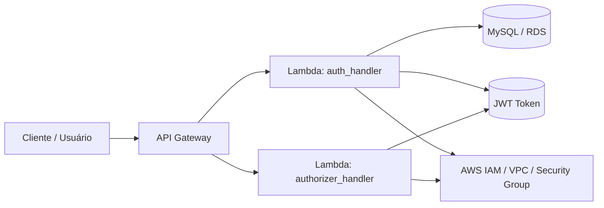

# SOAT Architecture - Tech Challenge Infra Lambda

Este repositório implementa a camada de autenticação e autorização de uma solução AWS Serverless para o desafio técnico da arquitetura SOAT. A infraestrutura provisiona funções Lambda em Python para validar credenciais, emitir JWT e autorizar acessos por meio de API Gateway e banco MySQL no Amazon RDS.

## Propósito

O objetivo principal deste projeto é fornecer um mecanismo seguro de autenticação para usuários e clientes, com os seguintes fluxos:

- autenticação de usuário por usuário/senha;
- autenticação de cliente por CPF;
- emissão de token JWT com claims de identidade, emissor e expiração;
- autorização em API Gateway por meio de Lambda authorizer;
- integração com banco de dados MySQL para validar status ativo/inativo da entidade.

## Arquitetura da solução

A solução foi pensada como um conjunto de serviços AWS integrados:

- API Gateway recebe as requisições HTTP;
- Lambda de autenticação valida dados e gera JWT;
- Lambda authorizer valida o token recebido nos requests protegidos;
- Amazon RDS MySQL guarda usuários e clientes;
- Terraform define a infraestrutura e o deployment;
- GitHub Actions executa validações e deploy automatizado em ambiente AWS.

## Tecnologias

- Python 3.12
- AWS Lambda
- API Gateway
- Amazon RDS / MySQL
- Terraform
- GitHub Actions
- JWT (HS256)
- PyMySQL e bcrypt
- AWS IAM e VPC

## Estrutura do repositório

```text
.
├── .github/
│   └── workflows/
│       ├── ci.yml
│       └── deploy.yml
├── src/
│   ├── auth_handler.py
│   ├── authorizer_handler.py
│   ├── main.tf
│   ├── requirements.txt
│   └── terraform.tfstate*
├── tests/
│   └── test_auth_handler.py
├── iam/
├── actions-runner/
├── README.md
└── .gitignore
```

## Componentes principais

### 1) Lambda de autenticação
Arquivo: `src/auth_handler.py`

Responsabilidades:

- validar payload de login;
- autenticar usuário por usuário/senha com bcrypt;
- autenticar cliente por CPF;
- verificar status ativo/inativo no banco;
- emitir JWT com `sub`, `role`, `iss`, `aud`, `iat` e `exp`.

### 2) Lambda authorizer
Arquivo: `src/authorizer_handler.py` 

Responsabilidades:

- receber token no cabeçalho `Authorization`;
- decodificar e validar JWT;
- retornar policy de autorização do tipo `Allow` ou `Deny` para API Gateway.

### 3) Infraestrutura Terraform
Arquivo: `src/main.tf`

Responsabilidades:

- provisionar funções Lambda `auto-repara-auth` e `auto-repara-authorizer`;
- configurar runtime Python 3.12;
- montar ambiente de variáveis de sistema;
- conectar as Lambdas à VPC e ao grupo de segurança do banco;
- empacotar dependências Python para Lambda;
- aplicar infraestrutura AWS via Terraform.

## Pré-requisitos

Antes de executar ou fazer deploy, certifique-se de ter:

- conta AWS com permissão para criar/alterar Lambda, IAM, VPC, RDS e API Gateway;
- AWS CLI configurado localmente;
- Terraform instalado na versão compatível;
- Python 3.12;
- acesso ao bucket S3 configurado no backend do Terraform;
- WSL ou ambiente Linux/macOS para empacotamento Lambda, caso esteja em Windows;
- variáveis de ambiente e secrets sensíveis configurados corretamente (`TF_VAR_rds_password`, `JWT_SECRET`, etc.).

## Requisitos de ambiente

Instale as dependências do projeto:

```bash
cd src
python -m pip install -r requirements.txt
```

Execute os testes:

```bash
cd tests
python -m unittest discover -s . -v
```

Ou a partir da raiz:

```bash
python -m unittest discover -s tests -v
```

## Execução local

Para validar o comportamento do código, os testes unitários cobrem:

- normalização de CPF;
- validação de CPF inválido;
- round-trip de JWT;
- processamento de status booleano.

Comando:

```bash
python -m unittest discover -s tests -v
```

## Deploy via Terraform

Acesse a pasta de infraestrutura:

```bash
cd src
```

Inicialize o Terraform:

```bash
terraform init
```

Valide a configuração:

```bash
terraform validate
```

Revise o plano:

```bash
terraform plan
```

Aplique a infraestrutura:

```bash
terraform apply -auto-approve
```

> Importante: o backend atual do Terraform aponta para um bucket S3 remoto (`amz-lab-techchallenge-pt3`) e usa `use_lockfile = true`.

## Pipeline de CI/CD

### CI
Arquivo: `.github/workflows/ci.yml`

Fluxo:

1. disparado em `push` para branches `feature/**` e em `pull_request` para `main`;
2. executa `terraform fmt -check`;
3. executa `terraform init -backend=false`;
4. executa `terraform validate`;
5. instala dependências Python;
6. executa testes unitários com `unittest`;
7. se tudo passar em uma branch de feature, abre automaticamente PR para `main`.

### Deploy
Arquivo: `.github/workflows/deploy.yml`

Fluxo:

1. acionado em `push` para `main` ou `master`;
2. executa em runner self-hosted Linux x64;
3. verifica credenciais AWS;
4. executa `terraform init`, `terraform validate`, `terraform plan` e `terraform apply -auto-approve`;
5. publica as mudanças na infraestrutura AWS.

## Fluxo de autenticação e autorização

### Autenticação do usuário

```json
POST /auth/usuario
{
  "usuario": "admin",
  "senha": "admin123"
}
```

Se for usuário válido, a função retorna um token JWT no formato:

```json
{
  "token": "eyJ...",
  "token_type": "Bearer",
  "expires_in": 3600
}
```

### Autenticação do cliente

O código aceita também autenticação por CPF quando o endpoint não é `/auth/usuario` e o payload contém um `cpf` válido.

### Autorização

O authorizer valida o JWT no header `Authorization` e responde com política IAM do tipo:

- `Allow` para requests autorizados;
- `Deny` para tokens inválidos, expirados ou ausentes.

## Diagrama do componente



## Variáveis e configurações importantes

No Terraform, as funções recebem as variáveis abaixo:

- `DB_HOST`
- `DB_PORT`
- `DB_NAME`
- `DB_USER`
- `DB_PASSWORD`
- `CLIENT_TABLE`
- `CLIENT_CPF_COLUMN`
- `CLIENT_STATUS_COLUMN`
- `USER_TABLE`
- `USER_USERNAME_COLUMN`
- `USER_PASSWORD_COLUMN`
- `USER_STATUS_COLUMN`
- `USER_ROLE_COLUMN`
- `JWT_SECRET`
- `JWT_ISSUER`
- `JWT_AUDIENCE`
- `JWT_EXPIRATION_SECONDS`

Essas configurações são críticas para a correta autenticação e segurança do sistema.

## Segurança

- nunca versionar segredos reais no repositório;
- utilizar AWS Secrets Manager ou parâmetros seguros em produção;
- manter `JWT_SECRET` forte e único por ambiente;
- restringir acesso ao banco e às Lambdas por IAM e grupos de segurança;
- validar status do cliente/usuário antes da geração do token.

## Swagger / Postman

Este repositório ainda não possui uma coleção OpenAPI/Swagger versionada neste projeto. Após o deploy do API Gateway, o caminho recomendado é:

- Swagger/OpenAPI: `https://<api-id>.execute-api.<region>.amazonaws.com/<stage>/swagger` ou equivalente gerado pela plataforma de API Gateway;
- Postman: atualizar com a collection oficial do projeto, por exemplo `https://www.postman.com/<workspace>/<collection>`.

> Ajuste o link real do Swagger/Postman conforme o ambiente de execução da equipe.

## Observações finais

Este projeto é uma base sólida para autenticação e autorização em arquitetura serverless na AWS, com foco em maturidade operacional, infraestrutura como código e automação de deploy. Para evoluir a solução, recomenda-se:

- expor documentação OpenAPI oficial;
- criar coleção Postman versionada;
- externalizar segredos em secret manager;
- adicionar testes de integração para API Gateway + Lambda + RDS;
- revisar políticas IAM e limites de segurança por ambiente.

## Contato

Projeto em evolução para a arquitetura SOAT. Ajustes e melhorias podem ser feitos conforme a governança de cada ambiente AWS e necessidade operacional do time.
